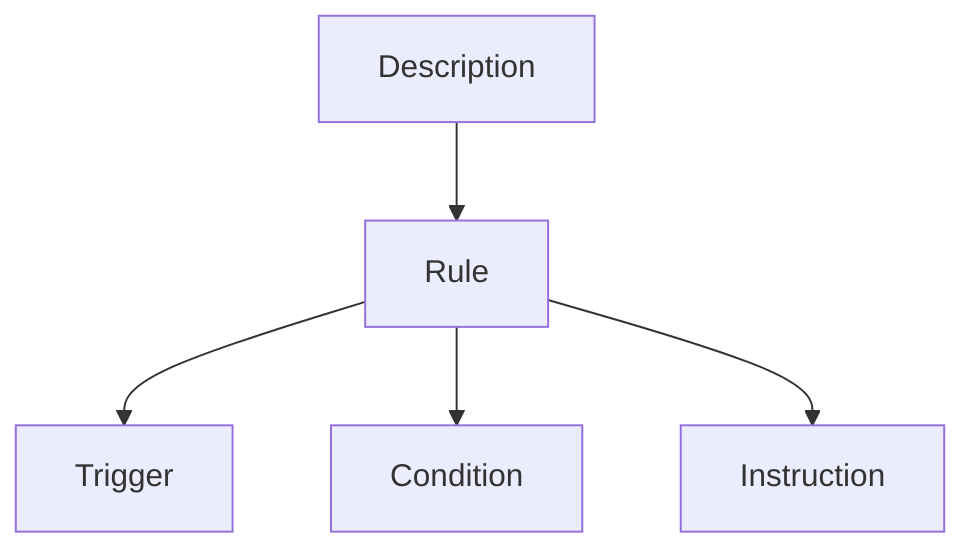

# Introducción

El proyecto consiste en diseñar el sistema de un juego de cartas y crear una gramática formal para el lenguaje de las descripciones de las cartas, que describen reglas que afectan al juego.

Se definirá un lenguaje natural controlado, es decir, un lenguaje formal subconjunto de un lenguaje natural con restricciones de léxico y de sintaxis.

Se utilizará la herramienta **Grammatical Framework (GL)** diseñada para generar lenguajes naturales junto con la **Resource Grammar Library (RGL)**, una librería extensa con constructores léxicos y sintácticos inteligentes que resuelven la concordancia de muchos idiomas, incluidos el inglés y el español.

Las cadenas generadas por el lenguaje serán convertidas, por medio de atributos que se definen en las reglas de producción de la gramática, a un archivo JSON con el siguiente formato:

```
[{ "func": ..., "args": ... }, ...]
```

utilizando los siguientes tipos:

- `str` es una palabra clave.
- `int` es un entero no negativo.
- `dict` es un registro con dos campos: `func: str` y `args: list`.
- `list` es una secuencia de elementos de cualquiera de los tipos mencionados.

Este formato está pensado para usarse como entrada de un intérprete que programa instrucciones utilizando un paradigma puramente funcional. Este enfoque viene dado por la morfología que se adopta comúnmente en este tipo de lenguajes.

# Modelo general

Cuando *se activa* una carta, un programa controlador ejecuta su *descripción*. La descripción es una secuencia de *reglas* que tienen un impacto en el juego. Las reglas son declaraciones de *instrucciones* sujetas a *condiciones*. El siguiente grafo muestra la jerarquía general del lenguaje:



Las condiciones son funciones booleanas. Los *activadores* son condiciones que evalúan el *evento* que activó la carta.

Las *acciones* son funciones que modifican el estado del juego. Las instrucciones y eventos son llamadas a una acción con ciertos argumentos, que pueden incluir

- Constantes con un tipo determinado, como `str` o `int`.
- Otras funciones que retornar referencias a objetos del juego como *jugadores* y *conjuntos* de cartas.

Un ejemplo de una descripción es:

> Cuando tú descartas esta carta: tú robas una carta de tu mazo. Si tu mano está vacía, tú robas una carta de tu mazo.

Está compuesta por dos reglas independientes:

1. *Cuando tú descartas esta carta: tú robas una carta de tu mazo.* El sujeto *tú* es el jugador que activó la carta. La instrucción *tú robas una carta de tu mazo* se ejecuta si la carta fue descartada.
2. *Si tu mano está vacía, tú robas una carta de tu mazo.* En esta regla se omite el activador. Esto se interpreta de forma equivalente a decir *cuando tú juegas esta carta*. La condición *tu mano está vacía* se evalúa después de validar el activador.

# Funciones

En esta sección se definen todas las funciones contempladas en el lenguaje y sus argumentos. Los tipos retornados son los siguientes:

- `nat` es un término o expresión natural.
- `bool` es un término o expresión booleana.
- `context` es una referencia a una entidad del juego.

Las funciones son de tipo `dict` que contiene el nombre de una función y los argumentos entregados. 

## Naturales

Funciones que retornan un término o expresión natural.

### Términos

```
natural: A natural number.

    Args:
        x (int): a natural number.

    Returns (nat): x.


size: The cardinal of a set of cards.

    Args:
        set (context): a set of cards.

    Returns (nat): the cardinal of that set.
```

### Expresiones

```
add: Add two natural terms.

    Args:
        x (nat): a natural term.
        y (nat): a natural term.

    Returns (nat): x + y.


multiply: Multiply two natural terms.

    Args:
        x (nat): a natural term.
        y (nat): a natural term.

    Returns (nat): x * y.
```

## Booleanas

Funciones que retornan un término o expresión booleana.

### Términos

```
less: Compare two natural terms or expressions.

    Args:
        x (nat): a natural term or expression.
        y (nat): a natural term or expression.

    Returns (bool): x < y.


more: Compare two natural terms or expressions.

    Args:
        x (nat): a natural term or expression.
        y (nat): a natural term or expression.

    Returns (bool): x > y.


equal: Compare two natural terms or expressions.

    Args:
        x (nat): a natural term or expression.
        y (nat): a natural term or expression.

    Returns (bool): x == y.


not_equal: Compare two natural terms or expressions.

    Args:
        x (nat): a natural term or expression.
        y (nat): a natural term or expression.

    Returns (bool): x != y.


less_equal: Compare two natural terms or expressions.

    Args:
        x (nat): a natural term or expression.
        y (nat): a natural term or expression.

    Returns (bool): x <= y.


more_equal: Compare two natural terms or expressions.

    Args:
        x (nat): a natural term or expression.
        y (nat): a natural term or expression.

    Returns (bool): x >= y.


empty: Guess if a set is empty.

    Args:
        set (context): a set of cards.

    Returns (bool): that set is empty.


event: Guess the event that activated this card.

    Args:
        action (context): the action that activated this card.

    Returns (bool): that action activated this card.
```

### Expresiones

```
pass: Pass a boolean term.

    Args:
        p (bool): a boolean term.

    Returns (bool): x.


not: Negate a boolean term.

    Args:
        p (bool): a boolean term.

    Returns (bool): not x.


or: Add two boolean terms.

    Args:
        p (bool): a boolean term.
        q (bool): a boolean term.

    Returns (bool): p or q.


and: Multiply two boolean terms.

    Args:
        p (bool): a boolean term.
        q (bool): a boolean term.

    Returns (bool): p and q.


xor: Compare of two boolean terms.

    Args:
        p (bool): a boolean term.
        q (bool): a boolean term.

    Returns (bool): p != q.
```

## De contexto

Funciones que retornan una referencia a una entidad del juego.

### Jugadores

Función que retorna un jugador.

```
player: A player.

    Args:
        role (str): active or inactive.

    Returns (context): the player with that role.
```

### Conjuntos

Funciones que retornan un conjunto de cartas.

```
this: This card.

    Returns (context): this card.


location: A set assigned to a player.

    Args:
        name (str): hand, deck or discard_pile.
        player (context): a player.

    Returns (context): the set with that name assigned to that player.


select: A subset with a fixed size.

    Args:
        set (context): a set of cards.
        size (nat): a natural term or expression.

    Returns (context): a subset of that set with that size.


conditional: A conditional set or action.

    Args:
        condition (bool): a boolean term or expression.
        set (context): a set of cards.

    Return (context): that set if the condition holds. Otherwise, the empty set.
```

### Acciones

Funciones que tienen un efecto en el juego.

```
play: A player activates one or more cards, then moves them to their discard pile.

    Args:
        player (context): a player.
        set (context): a set of cards.

    Returns (context): that set.


draw: A player moves one or more cards to their hand.

    Args:
        player (context): a player.
        set (context): a set of cards.

    Returns (context): that set.


discard: A player moves one or more cards to their discard pile.

    Args:
        player (context): a player.
        set (context): a set of cards.

    Returns (context): that set.


reveal: A player reveals one or more cards to their opponent.

    Args:
        player (context): a player.
        set (context): a set of cards.

    Returns (context): that set.
```

# Gramática

Para definir gramáticas en GL se recomienda partir de una **sintaxis abstracta** donde se declaran **categorías** que reflejan la semántica del lenguaje, y **funciones** que representan las reglas producción.

Posteriormente se define una **sintaxis concreta** de cada idioma, donde se termina de definir la sintaxis mediante la **linearización** de las funciones. Es recomendable crear las linearizaciones a partir de los constructores de la RGL, definidos [aquí](https://www.grammaticalframework.org/lib/doc/synopsis/).

Para mantener una estructura ordenada, se recomienda crear **módulos de recursos** que definen constructores personalizados, y **módulos léxicos** que declaran de las palabras. La sintaxis común a todos los idiomas se puede definir en un archivo de **sintaxis concreta incompleta**.

## Estructura de archivos

- `CG.gf` define la sintaxis abstracta.
- `CGI.gf`, `CGEng.gf` y `CGSpa.gf` definen la sintaxis concreta.
- `Lex.gf`, `LexEng.gf` y `LexSpa.gf` definen el léxico.
- `Func.gf` define constructores de atributos con el formato JSON propuesto.

# Ejemplos

En esta sección se muestran ejemplos de descripciones que acepta la gramática.

---

> **Inglés:** When you draw this card: your opponent plays this card.

> **Español:** Cuando tú robas esta carta: tu oponente juega esta carta.

```json
[{
    "func": "conditional",
    "args": [{
        "func": "event",
        "args": [{
            "func": "draw",
            "args": [{
                "func": "player",
                "args": ["active"]
            }, {
                "func": "this",
                "args": [""]
            }]
        }]
    }, {
        "func": "play",
        "args": [{
            "func": "player",
            "args": ["inactive"]
        }, {
            "func": "this",
            "args": [""]
        }]
    }]
}]
```

---

> **Inglés:** If your hand is empty, you draw 2 cards from your deck.

> **Español:** Si tu mano está vacía, tú robas 2 cartas de tu mazo.

```json
[{
    "func": "conditional",
    "args": [{
        "func": "event",
        "args": [{
            "func": "location",
            "args": ["hand", {
                "func": "player",
                "args": ["active"]
            }]
        }]
    }, {
        "func": "draw",
        "args": [{
            "func": "player",
            "args": ["active"]
        }, {
            "func": "select",
            "args": [{
                "func": "location",
                "args": ["deck", {
                    "func": "player",
                    "args": ["active"]
                }, "2"]
            }]
        }]
    }]
}]
```

# Guía de pruebas

Estos son algunos comandos útiles para probar la gramática desde la terminal de GF.

El comando `i` compila una gramática de un archivo `.gf` y la importa para usarla en la terminal.

```bash
i CGEng.gf
i CGSpa.gf
```

El comando `gr` genera un árbol sintáctico aleatorio. El parámetro `-depth` limita la profundidad máxima del árbol. El comando `l` lineariza un árbol sintáctico. El parámetro `-unlextext` revierte la tokenización de la cadena, `-table` muestra el valor de la cadena en formato JSON, `-treebank` muestra el árbol sintáctico y `-to_utf8` fuerza el formato UTF-8.

```
gr -depth=5 | l -unlextext -table -treebank -to_utf8
```

El comando `p` parsea una cadena de tokens.

```
input: p "you draw all the cards from your deck . "
output: UseBegin (UseRule (SimpleRule (SimpleInstruction (UseSimpleInst ActivePlayer DrawAction (AllLocation (DeckLocation ?3))))))
```

Mientras se ingresa la cadena, se pueden ver todas las posibles derivaciones del siguiente token presionando la tecla `Tab`.

```
CG> p ""
if    when  you   your
CG> p "you "
discard  draw     play     reveal
CG> p "you draw "
2     3     4     5     6     7     8     9     a     all   an    as    this
CG> p "you draw all the cards from your "
deck        discard     hand        opponent's
CG> p "you draw all the cards from your deck "
,    .    and  if
CG> p "you draw all the cards from your deck . "
if    when  you   your
```

El comando `ps -lextext` convierte una cadena de tokens en una cadena de texto.

```
input: ps -lextext "Tu oponente roba 2 cartas de tu mazo y las descarta."
output: tu oponente roba 2 cartas de tu mazo y las descarta .
```
